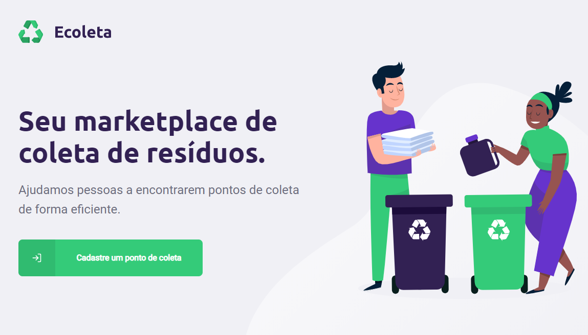
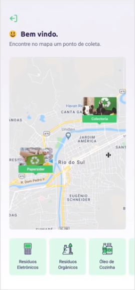

# Ecoleta

Projeto desenvolvido duranta a Next Level Week #1 da Rocketseat.

---

## Proposta

A proposta da aplicação é ajudar as pessoas a encontrar pontos de coleta corretos e próximos, de materiais descartáveis, como pilhas, óleo de cozinha, papel e papelão.

  
  

Na parte web da aplicação, é possível cadastrar novos pontos de coleta, informando o nome do local, marcando o endereço no mapa e selecionando o tipo de material que coleta.

Já na parte mobile da aplicação, é possível selecionar um estado e cidade, e através do mapa, visualizar os pontos de coleta existentes na região. Podendo selecioná-los para checar informações do local.

## Tecnologias
### Backend
- Node.js
- Typescript
- Express
- Knex
- Multer
- SqLite 3

### Frontend
- ReactJs
- Axios

### Mobile
- React Native
- Expo